# DOC 4.3-A: SƠ ĐỒ KIẾN TRÚC HỆ THỐNG

Tài liệu này mô tả chi tiết thiết kế kiến trúc cấp cao của hệ thống quản lý điều phối vận tải, phân rã hệ thống thành các thành phần chính, cách chúng giao tiếp và thể hiện bằng sơ đồ trực quan.

---

## 1. Tổng Quan Kiến Trúc

Hệ thống được thiết kế theo mô hình **Client-Server kết hợp Phân lớp (Layered/3-Tier Architecture)**. Mô hình này giúp chia nhỏ dự án thành các lớp có trách nhiệm riêng biệt:

1. **Lớp Trình Diễn (Presentation Layer - Frontend):** Được xây dựng bằng React dưới dạng ứng dụng đơn trang (SPA). Giao diện người dùng sẽ xử lý việc thu nhận tương tác, lưu trữ trạng thái hiển thị tạm thời và trực quan hóa dữ liệu nhận được từ backend.
2. **Lớp Định Tuyến và Nghiệp Vụ (API Routing & Business Logic - Backend):** Chạy trên nền Node.js sử dụng Express framework. Lớp này tiếp nhận các yêu cầu HTTP từ frontend, thực hiện xác thực, xử lý các nghiệp vụ (tạo đơn, phân phối xe, tính toán trạng thái, tiếp nhận sự cố) và trả về kết quả định dạng JSON.
3. **Lớp Truy Cập Dữ Liệu và Lưu Trữ (Data Access & Database Layer):** Sử dụng các schema Mongoose ODM làm cầu nối để thực hiện các truy vấn dữ liệu dạng SQL-like xuống cơ sở dữ liệu tài liệu **MongoDB Atlas** chạy trên đám mây.

---

## 2. Sơ Đồ Kiến Trúc Hệ Thống

Dưới đây là sơ đồ kiến trúc thể hiện rõ mối quan hệ từ giao diện người dùng, qua các API Routers, đến các bộ điều khiển nghiệp vụ (Controllers), các Mongoose Models tương ứng và cuối cùng là Database MongoDB Atlas:

```mermaid
graph TD
    subgraph Client ["Lớp Trình Diễn (React SPA - Frontend)"]
        LoginUI["Login / Register"]
        AdminDashboard["Admin Dashboard (Users, Vehicles)"]
        DispatcherDashboard["Dispatcher Dashboard (Orders, Assignments, Incidents)"]
        DriverDashboard["Driver Dashboard (Jobs, Status, GPS Simulator)"]
        ManagerDashboard["Manager Dashboard (Reports, KPIs, Incidents)"]
    end

    subgraph API_Routing ["Lớp Định Tuyến API (Express Routers)"]
        AuthRouter["/api/auth"]
        UserRouter["/api/users"]
        DriverRouter["/api/drivers"]
        VehicleRouter["/api/vehicles"]
        OrderRouter["/api/orders"]
        AssignmentRouter["/api/dispatch-assignments"]
        LocationRouter["/api/driver-locations"]
        IncidentRouter["/api/incidents"]
    end

    subgraph Business_Logic ["Lớp Nghiệp Vụ (Express Controllers)"]
        AuthController["AuthControllers.js"]
        UserController["UserControllers.js"]
        DriverController["DriverControllers.js"]
        VehicleController["VehicleControllers.js"]
        OrderController["OrderControllers.js"]
        AssignmentController["DispatchAssignmentControllers.js"]
        LocationController["DriverLocationControllers.js"]
        IncidentController["IncidentControllers.js"]
    end

    subgraph Data_Access ["Lớp Truy Cập Dữ Liệu (Mongoose ODM)"]
        UserM["User.js Schema"]
        DriverM["Driver.js Schema"]
        VehicleM["Vehicle.js Schema"]
        OrderM["Order.js Schema"]
        AssignmentM["DispatchAssignment.js Schema"]
        LocationM["DriverLocation.js Schema"]
        IncidentM["Incident.js Schema"]
    end

    subgraph Database_Layer ["Tầng Lưu Trữ (Database)"]
        MongoDBAtlas[("MongoDB Atlas Cloud Database")]
    end

    %% Mối quan hệ từ Giao diện đến Router API (HTTP JSON)
    LoginUI -->|POST /login| AuthRouter
    AdminDashboard -->|CRUD Users / Vehicles| UserRouter & VehicleRouter
    DispatcherDashboard -->|CRUD Orders, Assign, Track| OrderRouter & AssignmentRouter & LocationRouter & IncidentRouter
    DriverDashboard -->|PUT Status, GPS update, Report Incident| AssignmentRouter & LocationRouter & IncidentRouter
    ManagerDashboard -->|GET Statistics & Overview| OrderRouter & DriverRouter & IncidentRouter

    %% Mối quan hệ từ Router đến Controller (Internal calls)
    AuthRouter --> AuthController
    UserRouter --> UserController
    DriverRouter --> DriverController
    VehicleRouter --> VehicleController
    OrderRouter --> OrderController
    AssignmentRouter --> AssignmentController
    LocationRouter --> LocationController
    IncidentRouter --> IncidentController

    %% Mối quan hệ từ Controller sang Mongoose Model
    AuthController --> UserM
    UserController --> UserM
    DriverController --> DriverM & UserM
    VehicleController --> VehicleM
    OrderController --> OrderM
    AssignmentController --> AssignmentM & OrderM & DriverM & VehicleM
    LocationController --> LocationM & DriverM
    IncidentController --> IncidentM & AssignmentM & UserM

    %% Mối quan hệ từ Model xuống MongoDB Atlas Cloud
    UserM & DriverM & VehicleM & OrderM & AssignmentM & LocationM & IncidentM -->|MongoDB Protocol| MongoDBAtlas

    classDef react fill:#e1f5fe,stroke:#0288d1,stroke-width:2px,color:#01579b;
    classDef router fill:#fff3e0,stroke:#f57c00,stroke-width:2px,color:#e65100;
    classDef controller fill:#e8f5e9,stroke:#388e3c,stroke-width:2px,color:#1b5e20;
    classDef model fill:#fffde7,stroke:#fbc02d,stroke-width:2px,color:#f57f17;
    classDef db fill:#efebe9,stroke:#5d4037,stroke-width:2px,color:#3e2723;

    class LoginUI,AdminDashboard,DispatcherDashboard,DriverDashboard,ManagerDashboard react;
    class AuthRouter,UserRouter,DriverRouter,VehicleRouter,OrderRouter,AssignmentRouter,LocationRouter,IncidentRouter router;
    class AuthController,UserController,DriverController,VehicleController,OrderController,AssignmentController,LocationController,IncidentController controller;
    class UserM,DriverM,VehicleM,OrderM,AssignmentM,LocationM,IncidentM model;
    class MongoDBAtlas db;
```

---

## 3. Mô Tả Thành Phần

Các thành phần chính cấu thành nên hệ thống được liệt kê cụ thể dưới bảng sau:

| Tên Thành Phần | Phân Lớp | Trách Nhiệm Chi Tiết | Công Nghệ Sử Dụng |
| :--- | :--- | :--- | :--- |
| **Login / Register** | Presentation | Màn hình đăng nhập và đăng ký tài khoản mới. Thực hiện kiểm tra sơ bộ định dạng email, mật khẩu trước khi gửi lên backend. | React, Vanilla CSS |
| **Admin Dashboard** | Presentation | Dành cho quản trị viên tối cao: Quản lý danh sách người dùng (thêm, cập nhật role, khóa tài khoản) và quản lý danh sách phương tiện vận tải (xe máy, xe tải, container...). | React, Vanilla CSS |
| **Dispatcher Dashboard** | Presentation | Trọng tâm của hệ thống: Hiển thị danh sách đơn hàng đang chờ; thực hiện phân công tài xế và xe; bản đồ mô phỏng theo dõi vị trí xe thời gian thực; quản lý các sự cố phát sinh trên đường. | React, Lucide Icons |
| **Driver Dashboard** | Presentation | Giao diện cho tài xế: Xem công việc được giao; cập nhật trạng thái đơn hàng (Accepted, Rejected, In Progress, Completed); mô phỏng cập nhật vị trí GPS (lat, lng); báo cáo sự cố (tai nạn, hỏng xe, kẹt xe...). | React, GPS Simulator (Interval timer) |
| **Manager Dashboard** | Presentation | Phân hệ dành cho quản lý: Tổng hợp các báo cáo thống kê số lượng đơn hàng, đánh giá hiệu suất hoạt động của tài xế, tổng quan các sự cố đã giải quyết hoặc đang xử lý. | React, Vanilla CSS |
| **API Routers** | API Routing | Tập hợp các file routes (`userRouters.js`, `orderRouters.js`...) chịu trách nhiệm định nghĩa các URL endpoint và chuyển tiếp dữ liệu đến Controller tương ứng. | Express.js Router |
| **AuthControllers** | Business Logic| Xử lý nghiệp vụ đăng ký và đăng nhập. Thực hiện kiểm tra tài khoản, đối chiếu mật khẩu đã băm bằng `bcrypt` và thiết lập dữ liệu trả về cho client. | Express.js, bcrypt |
| **DispatchAssignmentControllers** | Business Logic| Xử lý logic nghiệp vụ phân công xe. Khi một phân công được tạo hoặc cập nhật trạng thái, controller này sẽ tự động thay đổi đồng bộ trạng thái của Đơn hàng (Order), Tài xế (Driver) và Xe (Vehicle). | Express.js |
| **DriverLocationControllers** | Business Logic| Tiếp nhận các gói tọa độ GPS gửi về từ Driver, lưu trữ dữ liệu hành trình lịch sử, và trả về vị trí mới nhất của tài xế phục vụ hiển thị bản đồ. | Express.js |
| **Mongoose Models** | Data Access | Tập hợp các Schema khai báo các trường dữ liệu, kiểu dữ liệu, các ràng buộc và quan hệ giữa các Collection trong cơ sở dữ liệu MongoDB Atlas. | Mongoose ODM |
| **MongoDB Atlas** | Database | Lưu trữ vĩnh viễn dữ liệu của toàn bộ hệ thống trên đám mây. | MongoDB Serverless |

---

## 4. Ma Trận Giao Tiếp Giữa Các Thành Phần

Bảng dưới đây định nghĩa phương thức, giao thức truyền thông và mục đích giao tiếp giữa các thành phần trong hệ thống:

| Từ Thành Phần | Đến Thành Phần | Giao Thức / Phương Thức | Nội Dung & Mục Đích Dữ Liệu |
| :--- | :--- | :--- | :--- |
| **React UI Components** | **Express Routers** | HTTP/HTTPS (REST API JSON) | Gửi các request HTTP (GET, POST, PUT, DELETE) kèm dữ liệu body dạng JSON. Nhận lại cấu trúc phản hồi dạng `{ success: boolean, message: string, data: ... }`. |
| **Express Routers** | **Express Controllers** | Lời gọi hàm nội bộ (JS Function Call) | Chuyển tiếp đối tượng `req` (request) và `res` (response) của Express đến hàm xử lý logic nghiệp vụ cụ thể. |
| **Express Controllers** | **Mongoose Models** | Các API của Mongoose (ORM Methods) | Thực hiện các lệnh truy vấn dữ liệu như `find()`, `findById()`, `create()`, `findOneAndUpdate()`, `save()`. |
| **Mongoose Models** | **MongoDB Atlas** | MongoDB Wire Protocol (Port 27017) | Thực hiện trao đổi dữ liệu thực tế giữa server backend NodeJS và máy chủ cơ sở dữ liệu đám mây MongoDB. |
| **Driver Dashboard** (Simulator) | **DriverLocation Router** | HTTP POST `/api/driver-locations` | Gửi định kỳ (mỗi 10 giây khi chuyến đi "in_progress") tọa độ GPS mô phỏng dạng `{ assignment_id, driver_id, lat, lng }` để lưu hành trình. |
| **Dispatcher Dashboard** | **DriverLocation Router** | HTTP GET `/api/driver-locations/latest/:driverId` | Gọi định kỳ (polling) để lấy tọa độ mới nhất của tài xế đang chạy đơn hàng để hiển thị vị trí của họ trên bản đồ giám sát. |
