# DOC 5.1-A: ĐẶC TẢ THÀNH PHẦN

Tài liệu này đặc tả chi tiết các thành phần trong các lớp của hệ thống quản lý điều phối vận tải, trách nhiệm của từng thành phần, mối quan hệ phụ thuộc giữa chúng và ma trận trách nhiệm đối với các yêu cầu chức năng.

---

## 1. Sơ Đồ Thành Phần (Component Diagram)

Sơ đồ dưới đây thể hiện sự phân chia các thành phần theo các lớp chức năng (Presentation, Business Logic, Data Access) và chiều phụ thuộc (từ trên xuống dưới):

```mermaid
graph TD
    subgraph Presentation_Layer ["Lớp Trình Diễn (React Frontend)"]
        UI_Login["Login Component"]
        UI_Register["Register Component"]
        UI_Admin["Admin Dashboard"]
        UI_Dispatcher["Dispatcher Dashboard"]
        UI_Driver["Driver Dashboard"]
        UI_Manager["Manager Dashboard"]
    end

    subgraph Business_Logic_Layer ["Lớp Định Tuyến & Nghiệp Vụ (Express Backend)"]
        Ctrl_Auth["AuthControllers.js"]
        Ctrl_User["UserControllers.js"]
        Ctrl_Driver["DriverControllers.js"]
        Ctrl_Vehicle["VehicleControllers.js"]
        Ctrl_Order["OrderControllers.js"]
        Ctrl_Assign["DispatchAssignmentControllers.js"]
        Ctrl_Loc["DriverLocationControllers.js"]
        Ctrl_Incident["IncidentControllers.js"]
    end

    subgraph Data_Access_Layer ["Lớp Truy Cập Dữ Liệu (Mongoose ODM)"]
        M_User["User Model"]
        M_Driver["Driver Model"]
        M_Vehicle["Vehicle Model"]
        M_Order["Order Model"]
        M_Assign["DispatchAssignment Model"]
        M_Loc["DriverLocation Model"]
        M_Incident["Incident Model"]
    end

    %% Mối quan hệ phụ thuộc (Dependency arrows)
    UI_Login --> Ctrl_Auth
    UI_Register --> Ctrl_Auth
    UI_Admin --> Ctrl_User & Ctrl_Vehicle
    UI_Dispatcher --> Ctrl_Order & Ctrl_Assign & Ctrl_Loc & Ctrl_Incident
    UI_Driver --> Ctrl_Assign & Ctrl_Loc & Ctrl_Incident
    UI_Manager --> Ctrl_Order & Ctrl_Driver & Ctrl_Incident

    Ctrl_Auth --> M_User
    Ctrl_User --> M_User
    Ctrl_Driver --> M_Driver & M_User
    Ctrl_Vehicle --> M_Vehicle
    Ctrl_Order --> M_Order
    Ctrl_Assign --> M_Assign & M_Order & M_Driver & M_Vehicle
    Ctrl_Loc --> M_Loc & M_Driver
    Ctrl_Incident --> M_Incident & M_Assign & M_User
```

---

## 2. Danh Mục Thành Phần (Component Catalog)

Dưới đây là bảng phân loại chi tiết các thành phần chính trong hệ thống:

| Tên Thành Phần | Lớp (Layer) | Trách Nhiệm Chi Tiết | Yêu Cầu Chức Năng | Phụ Thuộc (Dependencies) |
| :--- | :--- | :--- | :--- | :--- |
| **Login Component** | Presentation | Thu nhận email/mật khẩu, kiểm tra hợp lệ client, gọi API đăng nhập, lưu thông tin phiên vào LocalStorage. | REQ-001 (Đăng nhập) | `AuthControllers` |
| **Register Component** | Presentation | Form đăng ký tài khoản cho nhân viên/tài xế, kiểm tra độ dài mật khẩu và số điện thoại trước khi đăng ký. | REQ-002 (Đăng ký) | `AuthControllers` |
| **Admin Dashboard** | Presentation | Quản lý người dùng (CRUD tài khoản, thay đổi quyền/role) và quản lý danh mục phương tiện (CRUD xe). | REQ-003 (QL Tài khoản), REQ-004 (QL Xe) | `UserControllers`, `VehicleControllers` |
| **Dispatcher Dashboard**| Presentation | Màn hình của điều phối viên: Tiếp nhận đơn hàng, tìm kiếm và chọn tài xế + xe trống để phân công; hiển thị bản đồ xe di chuyển, giám sát sự cố. | REQ-005 (QL Đơn hàng), REQ-006 (Điều phối), REQ-010 (Giám sát) | `OrderControllers`, `DispatchAssignmentControllers`, `DriverLocationControllers`, `IncidentControllers` |
| **Driver Dashboard** | Presentation | Màn hình tài xế: Nhận/từ chối chuyến, cập nhật hành trình (Nhận hàng, Bắt đầu đi, Đến nơi, Hoàn thành), báo cáo sự cố, giả lập cập nhật GPS tự động. | REQ-007 (Cập nhật chuyến), REQ-008 (Định vị), REQ-009 (Báo sự cố) | `DispatchAssignmentControllers`, `DriverLocationControllers`, `IncidentControllers` |
| **Manager Dashboard** | Presentation | Màn hình của quản lý: Thống kê hiệu suất tài xế, tổng kết sự cố trên đường, tổng số đơn giao thành công/hủy theo thời gian. | REQ-011 (Thống kê KPI), REQ-012 (Báo cáo sự cố) | `OrderControllers`, `DriverControllers`, `IncidentControllers` |
| **AuthControllers** | Business Logic | Xác thực thông tin đăng nhập, mã hóa mật khẩu bằng `bcrypt`, đăng ký người dùng mới. | REQ-001, REQ-002 | `User Model` |
| **UserControllers** | Business Logic | Thực hiện CRUD người dùng và thay đổi vai trò. | REQ-003 | `User Model` |
| **DriverControllers** | Business Logic | CRUD thông tin tài xế, cập nhật trạng thái hoạt động và rating của tài xế. | REQ-006, REQ-011 | `Driver Model`, `User Model` |
| **VehicleControllers** | Business Logic | CRUD xe và cập nhật trạng thái bảo trì/sẵn sàng của phương tiện. | REQ-004 | `Vehicle Model` |
| **OrderControllers** | Business Logic | CRUD đơn hàng, xác thực thông tin đơn hàng hợp lệ khi tạo mới. | REQ-005 | `Order Model` |
| **DispatchAssignmentControllers** | Business Logic| Tạo phân công mới; kiểm tra tài xế/xe có trống hay không; cập nhật trạng thái phân công và đồng bộ trạng thái tài xế, xe, đơn hàng. | REQ-006, REQ-007 | `DispatchAssignment Model`, `Order Model`, `Driver Model`, `Vehicle Model` |
| **DriverLocationControllers**| Business Logic| Lưu trữ vị trí tọa độ GPS nhận về; cung cấp vị trí mới nhất của tài xế đang chạy đơn hàng để phục vụ giám sát. | REQ-008, REQ-010 | `DriverLocation Model`, `Driver Model` |
| **IncidentControllers** | Business Logic | Tạo mới sự cố, cập nhật trạng thái xử lý sự cố (Reported $\rightarrow$ Processing $\rightarrow$ Resolved). | REQ-009, REQ-012 | `Incident Model`, `DispatchAssignment Model`, `User Model` |

---

## 3. Ma Trận Trách Nhiệm (Responsibility Matrix)

Bảng dưới đây ánh xạ các thành phần (Hàng) với các yêu cầu chức năng chính (Cột). Đánh dấu `X` thể hiện thành phần đó tham gia triển khai yêu cầu:

| Thành Phần / Yêu Cầu | REQ-001 (Auth) | REQ-002 (Register) | REQ-003 (QL User) | REQ-004 (QL Xe) | REQ-005 (QL Đơn) | REQ-006 (Phân Công) | REQ-007 (Trạng Thái) | REQ-008 (Định Vị) | REQ-009 (Báo Lỗi) | REQ-010 (Theo Dõi) | REQ-011 (Thống Kê) | REQ-012 (QL Sự Cố) |
| :--- | :---: | :---: | :---: | :---: | :---: | :---: | :---: | :---: | :---: | :---: | :---: | :---: |
| **Login Component** | **X** | | | | | | | | | | | |
| **Register Component** | | **X** | | | | | | | | | | |
| **Admin Dashboard** | | | **X** | **X** | | | | | | | | |
| **Dispatcher Dashboard**| | | | | **X** | **X** | | | | **X** | | **X** |
| **Driver Dashboard** | | | | | | | **X** | **X** | **X** | | | |
| **Manager Dashboard** | | | | | | | | | | | **X** | **X** |
| **AuthControllers** | **X** | **X** | | | | | | | | | | |
| **UserControllers** | | | **X** | | | | | | | | | |
| **DriverControllers** | | | | | | **X** | | | | | **X** | |
| **VehicleControllers** | | | | **X** | | | | | | | | |
| **OrderControllers** | | | | | **X** | | | | | | | |
| **DispatchAssignmentControllers**| | | | | | **X** | **X** | | | | | |
| **DriverLocationControllers**| | | | | | | | **X** | | **X** | | |
| **IncidentControllers** | | | | | | | | | **X** | | | **X** |
