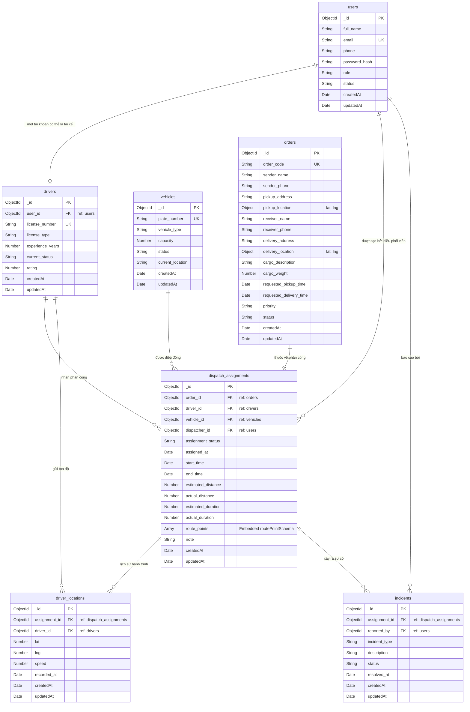

# DOC 5.3-A: THIẾT KẾ CƠ SỞ DỮ LIỆU VẬT LÝ

Tài liệu này đặc tả chi tiết thiết kế cơ sở dữ liệu vật lý của hệ thống quản lý điều phối vận tải, bao gồm sơ đồ thực thể liên kết vật lý (ERD), định nghĩa các Collection trong MongoDB và các cấu trúc Schema tương ứng.

---

## 1. Sơ Đồ ERD Vật Lý (Mermaid ERD)

Dưới đây là sơ đồ thực thể liên kết thể hiện cấu trúc vật lý của 7 Collections và các khóa ngoại/tham chiếu liên kết giữa chúng:



---

## 2. Đặc Tả Chi Tiết Các Collection (Schemas)

### 2.1. Collection: `users`
* **Mục đích:** Lưu trữ thông tin tài khoản người dùng của toàn bộ hệ thống.
* **Các trường dữ liệu:**
  | Tên Trường | Kiểu Dữ Liệu | Ràng Buộc | Giá Trị Mặc Định | Mô Tả |
  | :--- | :--- | :--- | :--- | :--- |
  | `_id` | ObjectId | Primary Key | Tự động sinh | Khóa chính duy nhất. |
  | `full_name` | String | Required, Trim | N/A | Họ và tên người dùng. |
  | `email` | String | Required, Unique, Lowercase, Trim | N/A | Địa chỉ email để đăng nhập. |
  | `phone` | String | Trim, Optional | N/A | Số điện thoại liên hệ. |
  | `password_hash`| String | Required | N/A | Mật khẩu đã được mã hóa băm bằng bcrypt. |
  | `role` | String | Required, Enum | N/A | Quyền: `admin`, `dispatcher`, `driver`, `manager`. |
  | `status` | String | Required, Enum | `active` | Trạng thái tài khoản: `active`, `inactive`. |

### 2.2. Collection: `drivers`
* **Mục đích:** Lưu trữ thông tin chuyên môn của các tài xế (mở rộng từ tài khoản người dùng).
* **Các trường dữ liệu:**
  | Tên Trường | Kiểu Dữ Liệu | Ràng Buộc | Giá Trị Mặc Định | Mô Tả |
  | :--- | :--- | :--- | :--- | :--- |
  | `_id` | ObjectId | Primary Key | Tự động sinh | Khóa chính duy nhất. |
  | `user_id` | ObjectId | Required, Unique | N/A | Tham chiếu ngoại tới bảng `users._id`. |
  | `license_number`| String | Required, Unique, Trim | N/A | Số bằng lái xe. |
  | `license_type` | String | Required, Enum | N/A | Loại bằng: `A1`, `A2`, `B1`, `B2`, `C`, `D`, `E`. |
  | `experience_years`| Number | Min: 0 | `0` | Số năm kinh nghiệm lái xe. |
  | `current_status`| String | Required, Enum | `available` | Trạng thái: `available`, `assigned`, `on_trip`, `off`. |
  | `rating` | Number | Min: 0, Max: 5 | `5` | Điểm đánh giá (0.0 đến 5.0). |

### 2.3. Collection: `vehicles`
* **Mục đích:** Danh mục các phương tiện vận chuyển thuộc đội xe.
* **Các trường dữ liệu:**
  | Tên Trường | Kiểu Dữ Liệu | Ràng Buộc | Giá Trị Mặc Định | Mô Tả |
  | :--- | :--- | :--- | :--- | :--- |
  | `_id` | ObjectId | Primary Key | Tự động sinh | Khóa chính. |
  | `plate_number` | String | Required, Unique, Trim | N/A | Biển số xe (ví dụ: 29C-123.45). |
  | `vehicle_type` | String | Required, Enum | `truck` | Loại xe: `motorbike`, `van`, `truck`, `container`. |
  | `capacity` | Number | Required, Min: 0 | N/A | Tải trọng tối đa (tính bằng kg hoặc m3). |
  | `status` | String | Required, Enum | `available` | Trạng thái: `available`, `in_use`, `maintenance`. |
  | `current_location`| String | Optional | N/A | Mô tả vị trí hiện tại của xe (ví dụ: Kho Đông Anh). |

### 2.4. Collection: `orders`
* **Mục đích:** Lưu trữ thông tin đơn hàng vận chuyển cần giao.
* **Các trường dữ liệu:**
  | Tên Trường | Kiểu Dữ Liệu | Ràng Buộc | Giá Trị Mặc Định | Mô Tả |
  | :--- | :--- | :--- | :--- | :--- |
  | `_id` | ObjectId | Primary Key | Tự động sinh | Khóa chính. |
  | `order_code` | String | Required, Unique, Trim | N/A | Mã đơn hàng duy nhất (ví dụ: ORD2026). |
  | `sender_name` | String | Required, Trim | N/A | Tên người gửi hàng. |
  | `sender_phone` | String | Required, Trim | N/A | Số điện thoại người gửi. |
  | `pickup_address`| String | Required | N/A | Địa chỉ nhận hàng dạng văn bản. |
  | `pickup_location`| Object | `{ lat: Number, lng: Number }` | N/A | Tọa độ GPS điểm nhận hàng. |
  | `receiver_name` | String | Required, Trim | N/A | Tên người nhận hàng. |
  | `receiver_phone`| String | Required, Trim | N/A | Số điện thoại người nhận. |
  | `delivery_address`| String | Required | N/A | Địa chỉ giao hàng dạng văn bản. |
  | `delivery_location`| Object | `{ lat: Number, lng: Number }` | N/A | Tọa độ GPS điểm giao hàng. |
  | `cargo_description`| String | Optional | N/A | Mô tả hàng hóa. |
  | `cargo_weight` | Number | Min: 0 | `0` | Khối lượng hàng hóa (kg). |
  | `priority` | String | Required, Enum | `normal` | Độ ưu tiên: `normal`, `high`, `urgent`. |
  | `status` | String | Required, Enum | `pending` | Trạng thái đơn: `pending`, `assigned`, `picked_up`, `in_transit`, `arrived`, `delivered`, `cancelled`. |

### 2.5. Collection: `dispatch_assignments`
* **Mục đích:** Lưu thông tin điều phối xe (liên kết Order - Driver - Vehicle).
* **Các trường dữ liệu:**
  | Tên Trường | Kiểu Dữ Liệu | Ràng Buộc | Giá Trị Mặc Định | Mô Tả |
  | :--- | :--- | :--- | :--- | :--- |
  | `_id` | ObjectId | Primary Key | Tự động sinh | Khóa chính. |
  | `order_id` | ObjectId | Required, Ref: `Order` | N/A | Mã đơn hàng được điều phối. |
  | `driver_id` | ObjectId | Required, Ref: `Driver` | N/A | Tài xế được chỉ định lái chuyến xe. |
  | `vehicle_id` | ObjectId | Required, Ref: `Vehicle` | N/A | Xe được chỉ định cho chuyến đi. |
  | `dispatcher_id` | ObjectId | Required, Ref: `User` | N/A | Nhân viên điều phối thực hiện thao tác. |
  | `assignment_status`| String | Required, Enum | `assigned` | Trạng thái: `assigned`, `accepted`, `rejected`, `in_progress`, `arrived`, `completed`, `cancelled`. |
  | `assigned_at` | Date | Required | `Date.now` | Thời điểm phân công. |
  | `start_time` | Date | Optional | N/A | Thời điểm thực tế tài xế bắt đầu hành trình. |
  | `end_time` | Date | Optional | N/A | Thời điểm hoàn thành chuyến đi. |
  | `estimated_distance`| Number | Optional | N/A | Khoảng cách dự kiến (km). |
  | `actual_distance`| Number | Optional | N/A | Khoảng cách di chuyển thực tế (km). |
  | `estimated_duration`| Number | Optional | N/A | Thời gian dự kiến di chuyển (phút). |
  | `actual_duration`| Number | Optional | N/A | Thời gian di chuyển thực tế (phút). |
  | `route_points` | Array | Mảng đối tượng RoutePoint | N/A | Danh sách các điểm trên tuyến đường đi. |
  | `note` | String | Optional | N/A | Ghi chú đi kèm. |

* **Cấu trúc Embedded Schema: `routePointSchema`**
  * `sequence_no`: Number (Required) - Thứ tự điểm dừng trên tuyến.
  * `address`: String - Địa chỉ điểm dừng.
  * `lat`: Number - Vĩ độ GPS.
  * `lng`: Number - Kinh độ GPS.
  * `point_type`: String (Enum: `pickup`, `waypoint`, `delivery`) - Loại điểm dừng.

### 2.6. Collection: `driver_locations`
* **Mục đích:** Lưu trữ nhật ký tọa độ hành trình của tài xế phục vụ giám sát vị trí.
* **Các trường dữ liệu:**
  | Tên Trường | Kiểu Dữ Liệu | Ràng Buộc | Giá Trị Mặc Định | Mô Tả |
  | :--- | :--- | :--- | :--- | :--- |
  | `_id` | ObjectId | Primary Key | Tự động sinh | Khóa chính. |
  | `assignment_id` | ObjectId | Required, Ref: `DispatchAssignment` | N/A | Liên kết tới phân công đang thực hiện. |
  | `driver_id` | ObjectId | Required, Ref: `Driver` | N/A | Tài xế di chuyển. |
  | `lat` | Number | Required, Min: -90, Max: 90 | N/A | Vĩ độ hiện tại. |
  | `lng` | Number | Required, Min: -180, Max: 180 | N/A | Kinh độ hiện tại. |
  | `speed` | Number | Min: 0 | `0` | Vận tốc di chuyển tức thời (km/h). |
  | `recorded_at` | Date | Required | `Date.now` | Thời điểm ghi nhận tọa độ GPS. |

* **Chỉ mục vật lý (Indexes):**
  Tạo compound index phục vụ tối ưu hóa tìm kiếm lịch sử hành trình:
  ```javascript
  driverLocationSchema.index({
    assignment_id: 1,
    driver_id: 1,
    recorded_at: -1
  });
  ```

### 2.7. Collection: `incidents`
* **Mục đích:** Báo cáo các sự cố phát sinh ngoài ý muốn trên đường đi.
* **Các trường dữ liệu:**
  | Tên Trường | Kiểu Dữ Liệu | Ràng Buộc | Giá Trị Mặc Định | Mô Tả |
  | :--- | :--- | :--- | :--- | :--- |
  | `_id` | ObjectId | Primary Key | Tự động sinh | Khóa chính. |
  | `assignment_id` | ObjectId | Required, Ref: `DispatchAssignment`| N/A | Chuyến xe xảy ra sự cố. |
  | `reported_by` | ObjectId | Required, Ref: `User` | N/A | Người báo cáo sự cố (tài xế). |
  | `incident_type` | String | Required, Enum | `other` | Loại: `traffic`, `accident`, `vehicle_breakdown`, `customer_issue`, `other`. |
  | `description` | String | Required | N/A | Mô tả chi tiết tình huống sự cố. |
  | `status` | String | Required, Enum | `reported` | Trạng thái: `reported`, `processing`, `resolved`. |
  | `resolved_at` | Date | Optional | N/A | Thời điểm xác nhận sự cố được xử lý xong. |

---

## 3. Tóm Tắt Lược Đồ Cơ Sở Dữ Liệu

* **Hệ quản trị cơ sở dữ liệu:** MongoDB Atlas (Cloud database).
* **Quy ước đặt tên (Naming Conventions):**
  * Tên Collection: Viết thường, ở số nhiều hoặc định dạng CamelCase phù hợp với Mongoose Model mapping (ví dụ: `User` $\rightarrow$ collection `users`).
  * Tên trường (Fields): Sử dụng quy tắc **snake_case** (ví dụ: `full_name`, `license_number`, `pickup_address`).
  * Tham chiếu khóa ngoại: Sử dụng kiểu dữ liệu `ObjectId` cùng khai báo thuộc tính `ref` để Mongoose hỗ trợ phương thức `.populate()` tự động kết nối dữ liệu giữa các collection tại backend.
