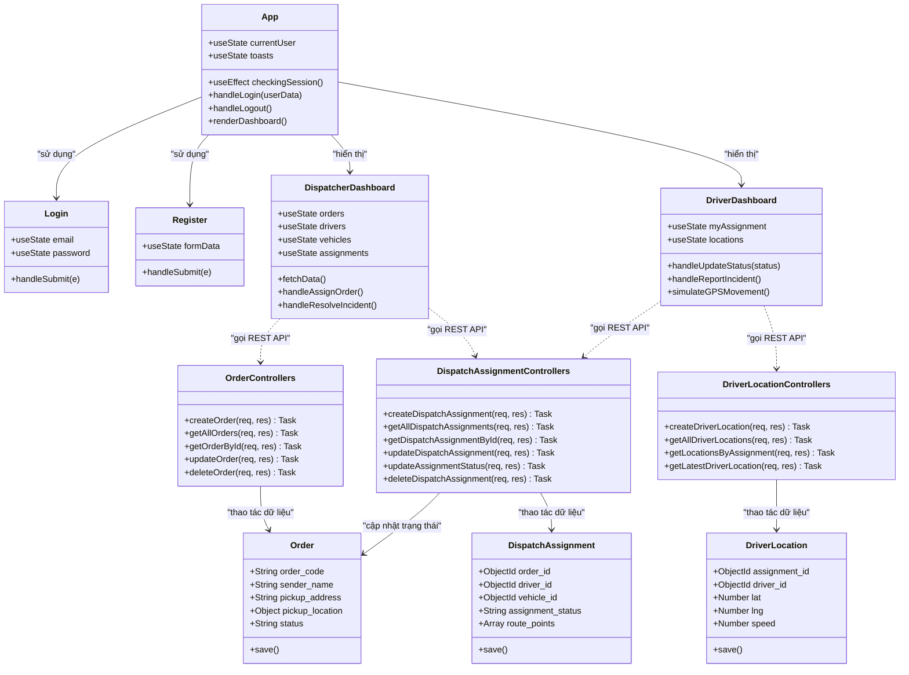

# DOC 6.1-A: SƠ ĐỒ LỚP CHI TIẾT

Tài liệu này trình bày thiết kế lớp chi tiết cho hệ thống quản lý điều phối vận tải. Mặc dù dự án sử dụng JavaScript (Node.js/Express) và React, cấu trúc mã nguồn được trừu tượng hóa theo mô hình Hướng đối tượng (OOP) để làm rõ vai trò, thuộc tính, phương thức và mối quan hệ giữa các lớp.

---

## 1. Sơ Đồ Lớp Tổng Quan (UML Class Diagram)

Sơ đồ UML dưới đây biểu diễn các lớp chính trong hệ thống, bao gồm các lớp Giao diện (React Components), lớp Điều khiển (Controllers), và lớp Dữ liệu (Mongoose Models/Entities):

---

## 2. Đặc Tả Lớp Chi Tiết (Class Specifications)

### 2.1. Nhóm Lớp Thực Thể Dữ Liệu (Mongoose Models/Entities)

#### **Lớp `Order`**
* **Mô tả:** Đại diện cho một đơn hàng cần vận chuyển.
* **Thuộc tính:**
  * `- order_code: String` (Mã đơn hàng, Unique)
  * `- sender_name: String` (Tên người gửi)
  * `- sender_phone: String` (SĐT người gửi)
  * `- pickup_address: String` (Địa chỉ nhận)
  * `- pickup_location: Object { lat, lng }` (Tọa độ nhận)
  * `- receiver_name: String` (Tên người nhận)
  * `- receiver_phone: String` (SĐT người nhận)
  * `- delivery_address: String` (Địa chỉ giao)
  * `- delivery_location: Object { lat, lng }` (Tọa độ giao)
  * `- cargo_description: String` (Mô tả hàng)
  * `- cargo_weight: Number` (Trọng lượng)
  * `- priority: String` (Độ ưu tiên)
  * `- status: String` (Trạng thái đơn hàng: `pending`, `assigned`, `in_transit`, `delivered`...)
* **Phương thức:**
  * `+ save(): Promise` (Lưu hoặc cập nhật trạng thái đơn hàng xuống DB)

#### **Lớp `DispatchAssignment`**
* **Mô tả:** Thông tin phân công điều phối xe và tài xế cho đơn hàng.
* **Thuộc tính:**
  * `- order_id: ObjectId` (Tham chiếu tới Order)
  * `- driver_id: ObjectId` (Tham chiếu tới Driver)
  * `- vehicle_id: ObjectId` (Tham chiếu tới Vehicle)
  * `- dispatcher_id: ObjectId` (Tham chiếu tới User)
  * `- assignment_status: String` (Trạng thái phân công: `assigned`, `accepted`, `in_progress`, `completed`...)
  * `- assigned_at: Date` (Thời điểm phân công)
  * `- start_time: Date` (Thời điểm bắt đầu hành trình)
  * `- end_time: Date` (Thời điểm hoàn thành hành trình)
  * `- route_points: Array` (Mảng các điểm dừng hành trình)
  * `- note: String` (Ghi chú)
* **Phương thức:**
  * `+ save(): Promise` (Lưu bản ghi phân công vào database)

---

### 2.2. Nhóm Lớp Xử Lý Nghiệp Vụ (Express Controllers)

#### **Lớp `DispatchAssignmentControllers`**
* **Mô tả:** Điều khiển logic tạo phân công và xử lý chuyển đổi trạng thái chuyến đi.
* **Thuộc tính:** N/A (Stateless Module)
* **Phương thức:**
  * `+ createDispatchAssignment(req, res): Promise<void>`
    * **Mô tả:** Tiếp nhận thông tin từ client, tạo phân công mới. Đồng thời cập nhật trạng thái của Order sang `assigned`, Driver sang `assigned`, và Vehicle sang `in_use`.
  * `+ updateAssignmentStatus(req, res): Promise<void>`
    * **Mô tả:** Cập nhật trạng thái chuyến xe. Xử lý đồng bộ dữ liệu:
      * Nếu trạng thái là `in_progress`: Đơn hàng chuyển sang `in_transit`, tài xế sang `on_trip`.
      * Nếu trạng thái là `completed`: Đơn hàng sang `delivered`, tài xế sang `available`, xe sang `available`.
      * Nếu trạng thái là `rejected` hoặc `cancelled`: Đơn hàng quay về `pending`, tài xế và xe sang `available`.

#### **Lớp `DriverLocationControllers`**
* **Mô tả:** Quản lý nhật ký định vị của tài xế.
* **Thuộc tính:** N/A
* **Phương thức:**
  * `+ createDriverLocation(req, res): Promise<void>`
    * **Mô tả:** Nhận gói tọa độ GPS gửi lên từ Driver Dashboard và ghi vào collection `driver_locations`.
  * `+ getLatestDriverLocation(req, res): Promise<void>`
    * **Mô tả:** Truy vấn bản ghi tọa độ có trường `recorded_at` mới nhất tương ứng với `driverId` để trả về cho Dispatcher hiển thị trên bản đồ.

---

### 2.3. Nhóm Lớp Giao Diện (React Components)

#### **Lớp `App` (Main Application Component)**
* **Mô tả:** Component gốc quản lý phiên đăng nhập và định tuyến Dashboard theo quyền người dùng.
* **Thuộc tính:**
  * `currentUser: Object` (Thông tin tài khoản đăng nhập hiện tại)
  * `toasts: Array` (Danh sách thông báo nổi hiển thị trên màn hình)
* **Phương thức:**
  * `renderDashboard(): JSX.Element` (Trả về giao diện Dashboard tương ứng với `currentUser.role`).
  * `handleLogin(userData): void` (Lưu thông tin user vào State và LocalStorage).
  * `handleLogout(): void` (Xóa session user và điều hướng về trang Login).

#### **Lớp `DriverDashboard`**
* **Mô tả:** Bảng điều khiển dành cho tài xế để nhận chuyến và cập nhật GPS.
* **Thuộc tính:**
  * `myAssignment: Object` (Thông tin chuyến xe được giao cho tài xế)
  * `isSimulating: Boolean` (Trạng thái giả lập di chuyển của tài xế)
* **Phương thức:**
  * `handleUpdateStatus(status): void` (Gọi API `PATCH /api/dispatch-assignments/:id/status` để đổi trạng thái đơn).
  * `simulateGPSMovement(): void` (Sử dụng `setInterval` để liên tục thay đổi tọa độ lat/lng trên đường đi và gọi API cập nhật vị trí lên server).
  * `handleReportIncident(): void` (Mở modal nhập thông tin sự cố phát sinh).
