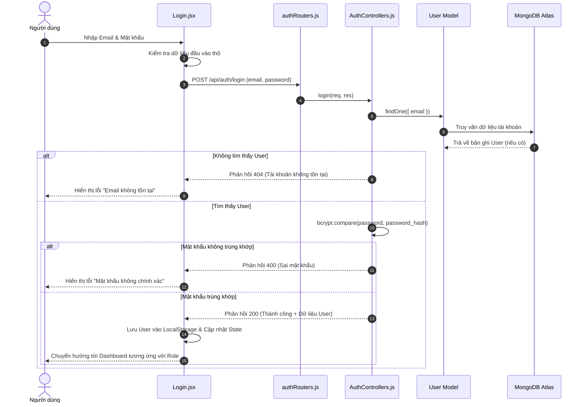
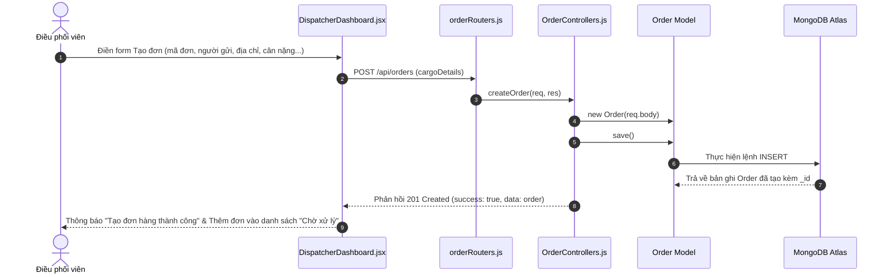
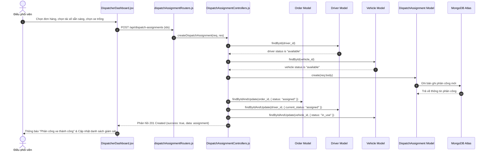
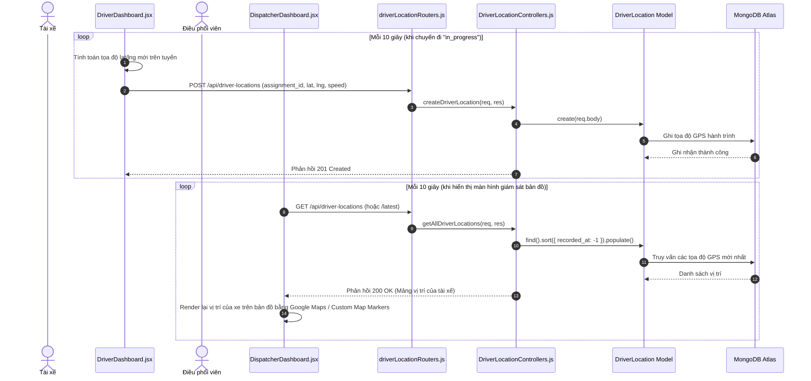
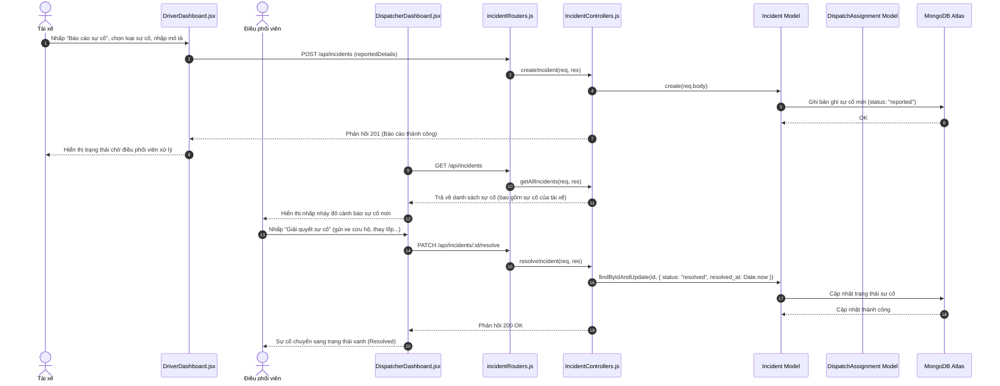

# DOC 6.2-A: SƠ ĐỒ TRÌNH TỰ (SEQUENCE DIAGRAMS)

Tài liệu này trình bày các sơ đồ trình tự thể hiện sự tương tác từng bước giữa các thành phần giao diện (Client Components), bộ định tuyến (Routers), bộ điều khiển nghiệp vụ (Controllers) và các mô hình dữ liệu (Models) cho 5 kịch bản nghiệp vụ cốt lõi của hệ thống.

---

## 1. Kịch Bản 1: Đăng Nhập Hệ Thống (User Authentication)

Mô tả luồng người dùng nhập tài khoản, gửi thông tin xác thực lên server và nhận phản hồi đăng nhập thành công hoặc lỗi:

---

## 2. Kịch Bản 2: Tạo Đơn Hàng Vận Chuyển Mới (Order Creation)

Mô tả quy trình điều phối viên nhập thông tin đơn hàng mới nhận được từ khách hàng vào hệ thống:

---

## 3. Kịch Bản 3: Điều Phối Phân Công Xe & Tài Xế (Order Dispatching)

Mô tả sự phối hợp khi điều phối viên giao đơn hàng đang chờ cho một tài xế và phương tiện trống:

---

## 4. Kịch Bản 4: Giả Lập Định Vị GPS & Theo Dõi Hành Trình (GPS & Real-time Tracking)

Mô tả luồng tài xế di chuyển giả lập tọa độ gửi về server và màn hình điều phối viên tự động polling lấy vị trí mới hiển thị trên bản đồ:

---

## 5. Kịch Bản 5: Báo Cáo Sự Cố & Xử Lý Sự Cố (Incident Reporting & Resolution)

Mô tả luồng tài xế gửi báo cáo sự cố khi di chuyển gặp trục trặc và điều phối viên duyệt giải quyết sự cố:

