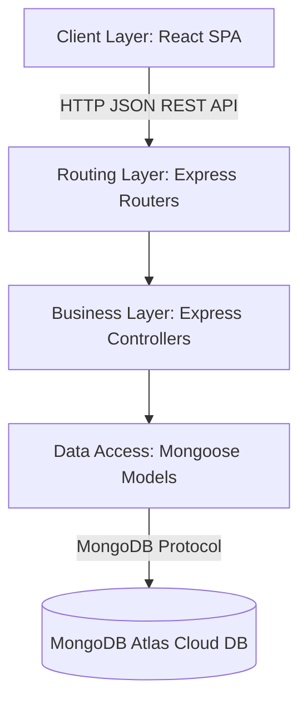

# BÁO CÁO THIẾT KẾ TỔNG THỂ HỆ THỐNG ĐIỀU PHỐI VẬN TẢI
*Tài liệu tổng hợp thiết kế Giai đoạn 1 - 4 (Tuần 1 đến Tuần 7)*

---

## PHẦN 1: PHÂN TÍCH YÊU CẦU (TUẦN 1 - TUẦN 3)

### 1. Tầm Nhìn, Mục Tiêu và Phạm Vi
* **Vấn đề cốt lõi:** Quy trình vận hành điều phối vận tải thủ công cũ gây ra trễ nải thông tin, khó kiểm soát hành trình tài xế, thất lạc báo cáo sự cố và thiếu dữ liệu đo lường hiệu suất (KPI).
* **Mục tiêu hệ thống:** Tự động hóa kết nối đơn hàng - phương tiện - tài xế; theo dõi vị trí xe thời gian thực; tiếp nhận xử lý sự cố tức thì và tự động tổng hợp KPIs báo cáo.
* **Phạm vi dự án:**
  * *Trong phạm vi:* Đăng ký, đăng nhập tài khoản; CRUD đơn hàng, xe, tài xế; Phân công điều phối; Giả lập định vị GPS hành trình; Báo cáo & xử lý sự cố; Dashboard KPIs.
  * *Ngoài phạm vi:* Thanh toán trực tuyến; Tự động tối ưu hóa lộ trình bằng AI; Kết nối GPS phần cứng (chỉ giả lập bằng phần mềm từ Driver Dashboard).

### 2. Người Dùng và Các Bên Liên Quan
Hệ thống quản lý phân quyền chặt chẽ cho 4 vai trò người dùng chính:
1. **Quản trị viên (Admin):** Quản lý tài khoản nhân viên và thông tin danh mục xe.
2. **Điều phối viên (Dispatcher):** Tiếp nhận đơn hàng, thực hiện phân công xe, theo dõi lộ trình và xử lý sự cố.
3. **Tài xế (Driver):** Tiếp nhận công việc, cập nhật trạng thái đơn hàng, gửi GPS mô phỏng và báo cáo sự cố.
4. **Quản lý (Manager):** Xem biểu đồ KPIs đơn hàng, hiệu suất làm việc của tài xế và thống kê sự cố.

### 3. Trường Hợp Sử Dụng (Use Cases) & Quy Trình
* **Danh mục Use Cases cốt lõi:**
  * *UC-001 (Đăng nhập):* Xác thực tài khoản người dùng truy cập Dashboard tương ứng.
  * *UC-002 (Quản lý Đơn hàng):* CRUD thông tin đơn hàng vận chuyển.
  * *UC-003 (Điều phối xe):* Gán đơn hàng cho tài xế và xe đang trống.
  * *UC-004 (Cập nhật định vị & Tiến độ):* Tài xế gửi tọa độ GPS và trạng thái giao hàng.
  * *UC-005 (Báo cáo sự cố):* Tài xế khai báo lỗi trên đường đi để điều phối viên hỗ trợ xử lý.
  * *UC-006 (Thống kê hiệu suất):* Xuất dữ liệu biểu đồ và KPI chấm điểm tài xế.
* **Quy trình hoạt động:** Đơn hàng (`pending`) $\rightarrow$ Phân công (`assigned`) $\rightarrow$ Tài xế chấp nhận, bắt đầu đi (`in_transit`, cập nhật tọa độ liên tục) $\rightarrow$ Hoàn thành giao nhận (`delivered`). Sự cố được báo cáo sẽ chuyển trạng thái xử lý độc lập (`reported` $\rightarrow$ `processing` $\rightarrow$ `resolved`).

### 4. Mô Hình Dữ Liệu Khái Niệm & Yêu Cầu Chức Năng
* **Thực thể dữ liệu chính (ERD):** `User` (Tài khoản), `Driver` (Tài xế), `Vehicle` (Phương tiện), `Order` (Đơn hàng), `DispatchAssignment` (Phân công điều phối), `DriverLocation` (Nhật ký tọa độ), và `Incident` (Sự cố phát sinh).
* **Ma trận CRUD chức năng:**
  * `User`: Create (REQ-002), Read (REQ-003), Update (REQ-003), Delete (REQ-003).
  * `Order`: Create (REQ-005), Read (REQ-005), Update (REQ-005), Delete (REQ-005).
  * `Vehicle`: Create (REQ-004), Read (REQ-004), Update (REQ-004), Delete (REQ-004).

---

## PHẦN 2: ĐỊNH NGHĨA KIẾN TRÚC HỆ THỐNG (TUẦN 4)

### 1. Thuộc Tính Chất Lượng (NFRs) & Ràng Buộc Kiến Trúc
* **Thuộc tính chất lượng chính:**
  * *Hiệu năng:* API RESTful nhẹ bằng JSON qua HTTP giúp cập nhật nhanh định vị xe.
  * *Tính sẵn sàng:* Lưu trữ dữ liệu an toàn trên đám mây MongoDB Atlas hỗ trợ Replica Set chuyển vùng dự phòng tự động.
  * *Bảo mật:* Mã hóa mật khẩu một chiều bằng `bcrypt` và phân quyền Dashboard chặt chẽ.
* **Các ràng buộc thiết kế:** Sử dụng Node.js/Express ở backend và React ở frontend, cơ sở dữ liệu MongoDB Atlas (theo connection string có sẵn trong tệp `databaseinfo.txt`), giao diện viết bằng Vanilla CSS trong `index.css`.

### 2. Kiến Trúc Phân Lớp & Thành Phần
Hệ thống sử dụng mô hình kiến trúc phân lớp Client-Server (3-Tier):
* **Presentation Layer (Client):** Ứng dụng SPA viết bằng React.
* **Business Logic Layer (Server):** NodeJS/Express API Routers và Controllers.
* **Data Access Layer:** Mongoose ODM map cấu trúc Schema và kết nối tới database.

### 3. Bản Ghi Quyết Định Kiến Trúc (ADRs)
* **ADR-01 (Mẫu kiến trúc):** Lựa chọn kiến trúc phân lớp kết hợp REST API thay vì Server-Side Rendering (SSR) để đảm bảo giao diện React cập nhật mượt mà không bị reload lại trang khi giám sát hành trình.
* **ADR-02 (Cơ sở dữ liệu):** Chọn cơ sở dữ liệu NoSQL **MongoDB** thay vì cơ sở dữ liệu quan hệ (SQL) nhằm lưu trữ trực quan cấu trúc mảng lồng nhau của tọa độ GPS hành trình và danh sách điểm dừng trên tuyến đi.
* **ADR-03 (Phương thức truyền tin):** Sử dụng cơ chế Short Polling (Client tự động gọi API lấy vị trí mới sau mỗi 8-10 giây) thay vì cài đặt WebSockets để giảm thiểu độ phức tạp và nguy cơ rò rỉ bộ nhớ ở máy chủ local.

---

## PHẦN 3: THIẾT KẾ CẤP CAO (TUẦN 5)

### 1. Phân Rã Thành Phần và Mối Quan Hệ Phụ Thuộc (Component Specification)
Các thành phần giao diện (React UI Components) phụ thuộc vào tầng API Controllers để gửi nhận dữ liệu. Tầng API Controllers phụ thuộc vào các Mongoose Models để thực thi các lệnh lưu trữ. Chiều phụ thuộc luôn đi từ lớp trên xuống lớp dưới, không có phụ thuộc vòng tròn:
* `LoginUI` / `RegisterUI` $\rightarrow$ `AuthControllers` $\rightarrow$ `User Model`.
* `DispatcherDashboard` $\rightarrow$ `OrderControllers` / `DispatchAssignmentControllers` / `IncidentControllers` $\rightarrow$ `Order` / `DispatchAssignment` / `Incident` Models.
* `DriverDashboard` $\rightarrow$ `DispatchAssignmentControllers` / `DriverLocationControllers` $\rightarrow$ `DispatchAssignment` / `DriverLocation` Models.

### 2. Đặc Tả REST API Endpoints
* **Base URL:** `http://127.0.0.1:5000/api`
* **Xác thực:** Lưu thông tin tài khoản đăng nhập hiện tại vào LocalStorage ở Frontend.
* **Các Endpoint chính:**
  * `POST /api/auth/login`: Xác thực tài khoản người dùng.
  * `POST /api/orders`: Tạo mới đơn hàng vận chuyển.
  * `POST /api/dispatch-assignments`: Tạo phân công xe cho đơn hàng.
  * `PATCH /api/dispatch-assignments/:id/status`: Tài xế/Hệ thống cập nhật trạng thái đơn.
  * `POST /api/driver-locations`: Tài xế gửi tọa độ GPS hành trình lên server.
  * `GET /api/driver-locations/driver/:driver_id/latest`: Lấy vị trí xe mới nhất để giám sát.
  * `POST /api/incidents`: Báo cáo sự cố từ tài xế.

### 3. Thiết Kế Cơ Sở Dữ Liệu Vật Lý (Physical Database Design)
Hệ thống bao gồm 7 Collection tương ứng với Mongoose Models:
1. **users:** Lưu thông tin đăng nhập, vai trò (`role: admin/dispatcher/driver/manager`), trạng thái.
2. **drivers:** Lưu thông tin bằng lái, kinh nghiệm, xếp hạng và trạng thái hoạt động.
3. **vehicles:** Biển số xe, chủng loại, tải trọng và trạng thái bảo trì.
4. **orders:** Thông tin người gửi/nhận, địa chỉ, cân nặng hàng và tọa độ GPS nhận/giao.
5. **dispatch_assignments:** Gắn kết đơn hàng với xe và tài xế, lưu trạng thái chuyến đi và danh sách các tọa độ điểm dừng hành trình (`route_points`).
6. **driver_locations:** Nhật ký tọa độ di chuyển của tài xế. Có chỉ mục phức hợp: `index({ assignment_id: 1, driver_id: 1, recorded_at: -1 })`.
7. **incidents:** Lưu loại sự cố, mô tả, người báo cáo và thời gian giải quyết sự cố.

### 4. Thiết Kế Bảo Mật
* **Xác thực:** Mật khẩu thô được băm một chiều có kèm muối bằng thư viện `bcrypt` (salt rounds = 10) trước khi lưu vào database.
* **Ủy quyền:** Phân quyền Dashboard ở Client dựa trên thuộc tính `role` của `currentUser`. API backend lọc và từ chối các yêu cầu sai quyền hạn dựa trên logic kiểm soát ID tài khoản.
* **Ngăn ngừa tấn công:** Sử dụng Mongoose ODM để tự động tham số hóa các câu truy vấn tránh NoSQL Injection; React tự động mã hóa dữ liệu đầu ra tránh tấn công XSS.

---

## PHẦN 4: THIẾT KẾ CẤP THẤP & KẾ HOẠCH TRIỂN KHAI (TUẦN 6 - TUẦN 7)

### 1. Sơ Đồ Lớp UML Chi Tiết (Class Diagram)
Các cấu trúc trong code được mô hình hóa thành các lớp hướng đối tượng (OOP):
* **Lớp Entity (Models):** `User`, `Driver`, `Vehicle`, `Order`, `DispatchAssignment`, `DriverLocation`, `Incident` chứa các trường dữ liệu private và phương thức public `+ save()`.
* **Lớp Logic (Controllers):** `AuthControllers`, `UserControllers`, `DriverControllers`, `VehicleControllers`, `OrderControllers`, `DispatchAssignmentControllers`, `DriverLocationControllers`, `IncidentControllers` chứa các phương thức xử lý không trạng thái (stateless) nhận tham số `req` và `res`.
* **Lớp UI (React Components):** `App` quản lý phiên đăng nhập và định tuyến; `Login` và `Register` thu nhận input; `AdminDashboard`, `DispatcherDashboard`, `DriverDashboard`, `ManagerDashboard` quản lý trạng thái hiển thị bằng React `useState` và `useEffect`.

### 2. Sơ Đồ Trình Tự (Sequence Diagrams)
* **Quy trình Đăng nhập:** Người dùng nhập thông tin $\rightarrow$ `Login.jsx` gọi API $\rightarrow$ `AuthControllers.js` tìm kiếm tài khoản trong DB $\rightarrow$ so sánh mật khẩu đã băm bằng `bcrypt` $\rightarrow$ Trả về token/user data $\rightarrow$ Lưu LocalStorage.
* **Quy trình Phân công xe:** Dispatcher chọn đơn, tài xế, xe $\rightarrow$ `DispatcherDashboard.jsx` gọi API $\rightarrow$ `DispatchAssignmentControllers.js` xác nhận tài xế & xe đang rảnh $\rightarrow$ Tạo bản ghi phân công $\rightarrow$ Đồng bộ trạng thái đơn hàng sang `assigned`, tài xế sang `assigned`, xe sang `in_use`.

### 3. Đặc Tả Thuật Toán (Algorithm Specification)
* **Thuật toán Đồng bộ trạng thái (Status Syncing):**
  * *Mục đích:* Đồng bộ trạng thái của đơn hàng, tài xế và xe khi trạng thái phân công thay đổi.
  * *Mã giả:* Khi `new_status` là `"in_progress"` $\rightarrow$ Đơn hàng = `"in_transit"`, Tài xế = `"on_trip"`. Khi `new_status` là `"completed"` $\rightarrow$ Đơn hàng = `"delivered"`, Tài xế = `"available"`, Xe = `"available"`.
* **Thuật toán Giả lập GPS (GPS Simulation):**
  * *Mục đích:* Tự động sinh tọa độ xe chạy dọc tuyến đường và gửi về server.
  * *Mã giả:* Tính khoảng cách lệch vĩ độ (`delta_lat`) và kinh độ (`delta_lng`) trên mỗi bước giả lập $\rightarrow$ Sử dụng `setInterval` chạy mỗi 10 giây tính tọa độ vị trí trung gian $\rightarrow$ Gọi API `POST /api/driver-locations` gửi tọa độ.

### 4. Chiến Lược Kiểm Thử (Test Strategy)
* **Cấp độ:** Unit Test (kiểm tra logic bcrypt, validate schema), Integration Test (gọi API bằng Postman xác nhận mã lỗi HTTP), Manual Test (chạy giả lập luồng đi của xe trực quan trên Dashboard).
* **Kịch bản ví dụ (TC-001 - Phân công xe):** Chọn đơn hàng `pending`, gán cho tài xế và xe rảnh $\rightarrow$ Bấm nút "Phân công" $\rightarrow$ Hiển thị thông báo thành công $\rightarrow$ Trạng thái đơn chuyển sang `assigned`, tài xế sang `assigned`, xe sang `in_use`.

### 5. Kế Hoạch Triển Khai 8 Tuần & Quản Trị Rủi Ro
* **Lịch trình thực hiện:**
  * *Tuần 1:* Cài đặt database và khung dự án.
  * *Tuần 2-3:* Phát triển các Model Mongoose và REST APIs CRUD cơ bản.
  * *Tuần 4:* Viết logic nghiệp vụ điều phối phân công xe.
  * *Tuần 5:* Viết API định vị GPS và báo cáo sự cố.
  * *Tuần 6:* Xây dựng giao diện Đăng nhập, Admin và Driver Dashboards.
  * *Tuần 7:* Tích hợp bản đồ giám sát xe thời gian thực và Manager Dashboard.
  * *Tuần 8:* Chạy thử toàn bộ hệ thống, kiểm thử vá lỗi và viết hướng dẫn bàn giao.
* **Quản trị rủi ro:** Khắc phục lỗi kết nối DNS MongoDB Atlas bằng cách ép cấu hình DNS tĩnh `8.8.8.8` trong tệp cấu hình database; khắc phục trễ hạn bằng cách chia nhỏ milestone và kiểm tra tiến độ định kỳ mỗi 2 ngày.
